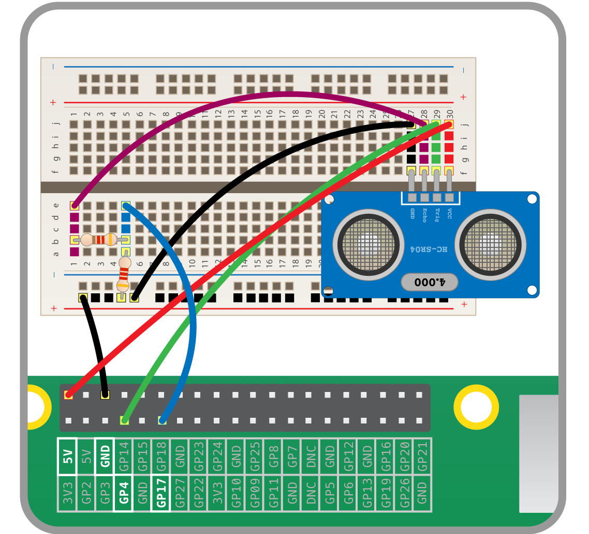

# Ultrasonic Distance Sensor

In air, sound travels at a speed of 343ms<sup>-1</sup>. An Ultrasonic Distance Sensor sends out pulses of ultrasound (which is inaudiable to humans) and when then detects the echo that is sent back when the sound bounces off a nearby object.


By knowing the speed of sound and the time taken for the ultrasound to be detected, and ultrasonic distance sensor can be used to detect how far away an object is.

## Wiring an Ultrasonic Distance Sensor

To wire up an ultrasonic distance sensor, you will need to use a pair of resistors as a potential divider.
Use the diagram below as a guide.



## Detecting distance

The ultrasonic distance sensor has not yet been included in the gpiozero library, but it will be soon. Until then, you can use a generic input and output device to detect the distance of an object.


```python
from gpiozero import InputDevice, OutputDevice
from time import sleep, time

trig = OutputDevice(4)
echo = InputDevice(17)

sleep(2)

def get_pulse_time():
    trig.on()
   	sleep(0.00001)
	trig.off()

	while echo.is_active == False:
		pulse_start = time()

	while echo.is_active == True:
		pulse_end = time()

	sleep(0.06)

	return pulse_end - pulse_start

def calculate_distance(duration):
	speed = 343
	distance = speed * duration / 2
	return distance

while True:
	duration = get_pulse_time()
	distance = calculate_distance(duration)
	print(distance)
```

